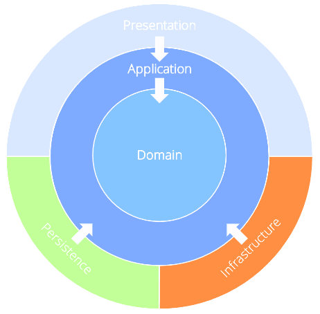

# ONIONARCH.Template

A .NET reference implementation of Onion Architecture with CQRS dispatch and swappable
persistence backends (SQL Server, PostgreSQL, MySQL).

## API reference

Generated by [DocFX](https://dotnet.github.io/docfx/) from the XML documentation comments (`///`)
in the source code. Entry points by layer:

| Layer          | Namespace                                                                  |
|----------------|----------------------------------------------------------------------------|
| Domain         | [ONIONARCH.Domain.Entities](api/ONIONARCH.Domain.Entities.md)              |
| Application    | [ONIONARCH.Application](api/ONIONARCH.Application.md)                      |
| Persistence    | [ONIONARCH.Persistence](api/ONIONARCH.Persistence.md)                      |
| Infrastructure | [ONIONARCH.Infrastructure](api/ONIONARCH.Infrastructure.md)                |
| Presentation   | [API](api/ONIONARCH.Presentation.API.md), [Web](api/ONIONARCH.Presentation.Web.md), [Console](api/ONIONARCH.Presentation.Console.md) |

### All namespaces

- [ONIONARCH.Application](api/ONIONARCH.Application.md)
- [ONIONARCH.Application.Abstractions](api/ONIONARCH.Application.Abstractions.md)
- [ONIONARCH.Application.Abstractions.ConnectionFactory](api/ONIONARCH.Application.Abstractions.ConnectionFactory.md)
- [ONIONARCH.Application.Abstractions.Context](api/ONIONARCH.Application.Abstractions.Context.md)
- [ONIONARCH.Application.Abstractions.Repositories](api/ONIONARCH.Application.Abstractions.Repositories.md)
- [ONIONARCH.Application.Actions.SampleEntityDapper.Commands](api/ONIONARCH.Application.Actions.SampleEntityDapper.Commands.md)
- [ONIONARCH.Application.Actions.SampleEntityDapper.Queries](api/ONIONARCH.Application.Actions.SampleEntityDapper.Queries.md)
- [ONIONARCH.Application.Actions.SampleEntityEFCore.Commands](api/ONIONARCH.Application.Actions.SampleEntityEFCore.Commands.md)
- [ONIONARCH.Application.Actions.SampleEntityEFCore.Queries](api/ONIONARCH.Application.Actions.SampleEntityEFCore.Queries.md)
- [ONIONARCH.Application.Behaviors](api/ONIONARCH.Application.Behaviors.md)
- [ONIONARCH.Application.Contracts.Dtos](api/ONIONARCH.Application.Contracts.Dtos.md)
- [ONIONARCH.Domain.Abstractions](api/ONIONARCH.Domain.Abstractions.md)
- [ONIONARCH.Domain.Entities](api/ONIONARCH.Domain.Entities.md)
- [ONIONARCH.Infrastructure](api/ONIONARCH.Infrastructure.md)
- [ONIONARCH.Infrastructure.Correlation](api/ONIONARCH.Infrastructure.Correlation.md)
- [ONIONARCH.Infrastructure.Exceptions](api/ONIONARCH.Infrastructure.Exceptions.md)
- [ONIONARCH.Infrastructure.HealthChecks](api/ONIONARCH.Infrastructure.HealthChecks.md)
- [ONIONARCH.Infrastructure.Versioning](api/ONIONARCH.Infrastructure.Versioning.md)
- [ONIONARCH.Persistence](api/ONIONARCH.Persistence.md)
- [ONIONARCH.Persistence.ConnectionFactory](api/ONIONARCH.Persistence.ConnectionFactory.md)
- [ONIONARCH.Persistence.Contexts](api/ONIONARCH.Persistence.Contexts.md)
- [ONIONARCH.Persistence.Options](api/ONIONARCH.Persistence.Options.md)
- [ONIONARCH.Persistence.Providers](api/ONIONARCH.Persistence.Providers.md)
- [ONIONARCH.Persistence.Repositories](api/ONIONARCH.Persistence.Repositories.md)
- [ONIONARCH.Presentation.API](api/ONIONARCH.Presentation.API.md)
- [ONIONARCH.Presentation.API.Controllers](api/ONIONARCH.Presentation.API.Controllers.md)
- [ONIONARCH.Presentation.API.Extensions](api/ONIONARCH.Presentation.API.Extensions.md)
- [ONIONARCH.Presentation.Console](api/ONIONARCH.Presentation.Console.md)
- [ONIONARCH.Presentation.Web](api/ONIONARCH.Presentation.Web.md)
- [ONIONARCH.Presentation.Web.Components](api/ONIONARCH.Presentation.Web.Components.md)
- [ONIONARCH.Presentation.Web.Components.Layout](api/ONIONARCH.Presentation.Web.Components.Layout.md)
- [ONIONARCH.Presentation.Web.Components.Pages](api/ONIONARCH.Presentation.Web.Components.Pages.md)

Source, build instructions, and versioning details are in the
[repository README](https://github.com/Vercuski/ONIONARCH.Template#readme).
